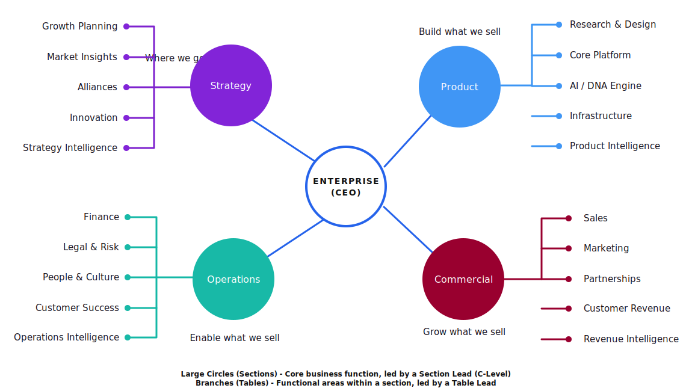

# JOBZCAFE Agent Work Operating System PRD

Last updated: 2026-05-23

## 1. Purpose

JOBZCAFE needs one protected operating system for humans and agents to coordinate real work across BOH, Cafe, product, commercial, operations, enterprise/CEO work, and strategy.

The system should reduce human workload. It should not become another place where people have to manually manage complex agent queues, copy context between tools, or understand technical runtime details.

The core product direction is:

```text
Humans work in Tablez & Chairz.
Agents execute and report in Central Command.
Visual/product review happens in Central/App Studio.
Human chat happens in Chatz.
Jarvis remains a separate advisory/mentor experience.
Forge controls delivery and release gates.
Hermes is the primary agent runtime/brain underneath Central.
Supabase Edge Functions protect privileged actions.
```

## 2. Product Vision

Central Command should become the protected browser-based control layer where JOBZCAFE can see what agents are doing, review output, answer blockers, approve work, and control promotion toward production.

Tablez & Chairz should remain the human-facing work management system. Humans should be able to add thoughts, rough notes, triage items, project work, and section tasks without needing to understand whether the work will later be handled by Maverick, Rocket, Jarvis, Hermes, Codex, another agent, or a human.

Hermes should be the main agent runtime/orchestration system. Hermes can learn from work over time, maintain agent memory/lessons, coordinate agent capabilities, and route approved work to suitable agents. Central Command should expose Hermes safely through BOH rather than asking humans to operate Hermes directly.

## 3. Core Apps And Responsibilities

### Tablez & Chairz

Tablez & Chairz is the human project and work management app.

Responsibilities:

- Human triage.
- Human kanban.
- Thoughts, items, tasks, and daily work.
- Section/table/chair context.
- Assignments to human staff.
- Lead-human work ownership.
- Sending suitable work to a lead agent or Central.
- Showing when an agent needs the human to answer something.

Tablez should not become the agent execution board. It should show the human-friendly status of work and link to Central when an agent is executing or awaiting review.

### Central Command

Central Command is the agent execution, review, approval, and evidence layer.

Responsibilities:

- Agent kanban.
- Agent movement/3D system view.
- Agent task execution state.
- Agent-to-human questions.
- Agent-to-agent coordination.
- Work evidence, screenshots, preview links, PR links, logs, and summaries.
- Product/design review.
- Human approvals and rejection/revision decisions.
- Protected dispatch to Hermes or other runtimes.
- No production action without explicit human approval.

Central should not become the daily human task manager.

### App Studio

App Studio can be a Central module or BOH app focused on visual/product review.

Responsibilities:

- Show app/module design work.
- Show branch/preview URL/screenshots.
- Compare current and proposed screens.
- Let product leads or CEO approve, reject, or request changes.
- Record sign-off before Forge release gate.

App Studio should feel like a product review cockpit, not a developer terminal.

### Chatz

Chatz is the internal company communication layer.

Responsibilities:

- Human-to-human messaging.
- Section channels.
- Task-linked conversations.
- Workstream/ticket-linked conversations.
- Operational agent-to-human and agent-to-agent chat, where appropriate.
- Voice input, images, and file uploads.

Chatz can host operational conversations with agents. It should not replace Jarvis.

### Jarvis

Jarvis is a separate advisory and mentor experience.

Responsibilities:

- CEO/lead-human advisory conversation.
- Strategy, reflection, mentoring, decision support.
- Freeform conversation with memory.
- Can suggest Tablez items, Central tasks, Chatz messages, or Forge decisions, but should not become the general company chat system.

Jarvis should feel different from a task executor or generic chatbot.

### Forge

Forge owns delivery management and release readiness.

Responsibilities:

- Initiatives submitted from Menu.
- Workstreams.
- Major/minor release visibility.
- Release readiness.
- Human-gated production promotion.
- SQL, Edge Function, secret, smoke-test, and rollback checklist gates.

### Counter

Counter owns tickets, bugs, support issues, requester context, ticket priority/status, and minor release ticket assignment.

### Menu

Menu owns initiatives, user stories, app/module planning, roadmap, and product planning.

## 4. Human Section Model

The system should support these first-class sections:

```text
Commercial
Product
Operations
Enterprise
Strategy
```

Enterprise is the CEO/founder section.



Each section should have:

- Lead human.
- Lead agent.
- Supporting agents.
- Reviewers.
- Approval rules.
- Workstream scope.
- Escalation rules.
- Default Chatz channel.

Example:

```text
Enterprise
  lead human: CEO
  lead agents: Maverick, Jarvis
  Maverick: chief-of-staff execution and coordination
  Jarvis: mentor, advisor, strategy
  default rule: CEO approves high-risk actions
```

```text
Product
  lead human: Head of Product
  lead agent: Rocket
  Rocket: checks Forge, initiatives, user stories, tickets, and product work
  default rule: Head of Product approves product/design output
```

Initial section lead agent map:

```text
Enterprise
  lead agents: Maverick, Jarvis
  Maverick: CEO chief-of-staff execution and coordination
  Jarvis: CEO mentor, advisor, strategy, and freeform thinking partner

Product
  lead agent: Rocket
  specialist agents: product build/coding agents, product QA/testing agent, design review support

Strategy
  lead agent: Mantis

Commercial
  lead agent: Nebula
  Marketing table agent: Quill

Operations
  lead agent: Gamora
  Finance table agent: still needed
```

Table-level agents should be created only when a table has enough recurring work to justify a dedicated worker. The default model should be one lead agent per section plus shared specialist agents for testing, coding, design review, SQL/RLS, and release readiness.

## 5. Agent Roles

Agents should appear as workers inside the operating system, not as disconnected chatbots.

Initial named agents:

- Hermes: primary runtime/orchestration brain.
- Maverick: CEO chief-of-staff lead agent.
- Jarvis: CEO mentor/advisor.
- Rocket: product lead agent.
- Mantis: Strategy lead agent.
- Nebula: Commercial lead agent.
- Quill: Marketing table agent under Commercial.
- Gamora: Operations lead agent.
- Codex agents: coding/build/review workers.
- Product QA/testing agent: product testing specialist, existing or to be confirmed.
- Finance agent: needed later, should be created only after finance permissions and audit rules are clear.
- Other specialist agents as needed for QA, design, SQL, Edge Functions, support, content, and release review.

Each agent should have:

- Runtime id.
- Display name.
- Section.
- Lead human.
- Role/purpose.
- Capabilities.
- Allowed tools.
- Connected runtime.
- Default model.
- Autonomy level.
- Approval requirements.
- Cost/risk level.
- Current work.
- Recent outputs.
- Lessons/memory, excluding secrets.

### Agent Naming Pool

New agents should be named from an approved character-name pool so the system feels coherent and memorable.

Preferred naming families:

- Guardians of the Galaxy.
- Avengers.

Agent creation UI should offer a controlled list of available approved names rather than free-form names by default. A name should be marked as reserved once assigned to an active agent. Retired names should not be reused without human approval.

### Agent Creation Governance

Maverick should be the primary agent that creates or provisions new agents.

Default flow:

```text
Lead human or lead agent identifies need for extra help
  -> request goes to Maverick
  -> Maverick checks whether an existing agent can handle it
  -> if not, Maverick proposes a new agent
  -> proposal includes name, section, role, tools, model, permissions, cost/risk, and expected duration
  -> human approves if required
  -> Maverick creates/provisions the agent through protected Central/Hermes APIs
```

Lead agents such as Rocket, Mantis, Nebula, Quill, and Gamora may request additional agents, but they should not directly create unrestricted agents unless a later governance rule explicitly allows it.

## 6. Tablez Human Triage Flow

Humans should be able to add rough work into Tablez without having to know the final workflow.

Examples:

- CEO adds a thought.
- Product lead adds a product idea.
- Operations lead adds an operational issue.
- Commercial lead adds a customer/commercial follow-up.
- Strategy lead adds a strategic question.

Flow:

```text
Human adds triage item in Tablez
  -> section lead agent reviews it
  -> lead agent classifies it
  -> lead agent proposes action
  -> human approves or allows low-risk automation
  -> item becomes one or more:
       Tablez task
       Central task
       Chatz conversation
       Counter ticket
       Menu initiative/story
       Forge workstream/release concern
       Jarvis advisory conversation
```

Lead agent options:

- Answer directly.
- Ask human for clarification.
- Create Tablez task.
- Create Central task.
- Assign to another agent.
- Send to Jarvis.
- Link to existing initiative/story/ticket/workstream.
- Defer or schedule follow-up.

## 7. Central Agent Kanban Flow

Central should replicate the useful workflow pattern from Hermes kanban, adapted to BOH.

Recommended Central lanes:

```text
Triage
Todo
Scheduled
Ready
In Progress
Blocked
Review
Done
```

Lane meanings:

- Triage: raw agent work, unclear or newly received.
- Todo: known work, waiting on dependencies or assignment.
- Scheduled: waiting for time-based follow-up or recurring routine.
- Ready: dependencies satisfied and ready to dispatch.
- In Progress: claimed by worker/agent and actively being worked.
- Blocked: agent needs human input or external dependency.
- Review: output is ready for human/product/code/design review.
- Done: completed with evidence/results captured.

Blocked work must produce a clear human-facing question and notify the correct lead human or requester.

## 8. Central 3D Agent Movement View

The existing Central 3D map should remain as a system visualization.

It should answer:

- Which agents are active?
- Which work areas are active?
- Who is collaborating?
- Where are blockers?
- Which section is busy?
- What changed recently?

The 3D view should not be the only operational interface. It should sit alongside:

- Agent kanban.
- Decisions queue.
- Work details.
- Activity feed.
- Agent chats.
- Evidence/review panels.

## 9. App Studio / Review Flow

App Studio should support visual review of agent/human development work.

Flow:

```text
Central task or Tablez task
  -> agent/human builds in dev branch
  -> preview URL and screenshots are captured
  -> App Studio review page is created
  -> CEO/product lead reviews actual screens
  -> approve / request changes / reject / defer
  -> approved work goes to Forge release gate
```

Review record should include:

- Source task.
- App/module.
- Branch.
- Pull request.
- Preview URL.
- Desktop screenshots.
- Mobile screenshots.
- Relevant logs.
- Agent summary.
- Known risks.
- Reviewer.
- Approval status.
- Timestamp.

Approval statuses:

```text
draft
in_build
ready_for_design_review
changes_requested
product_approved
ready_for_release_gate
released
```

## 10. Chatz Messaging Layer

Chatz should be the shared internal messaging fabric.

Conversation types:

- Human to human.
- Human to agent.
- Agent to human.
- Agent to agent.
- Section channel.
- Tablez task thread.
- Central task thread.
- Forge workstream thread.
- Counter ticket thread.
- Menu initiative/story thread.

Required capabilities:

- Text.
- Voice input.
- Image upload.
- File upload.
- Linked work object context.
- Mentions.
- Notifications.
- Search.
- Permissions.
- Audit/history for work-related decisions.

Central and Tablez should embed or link the relevant Chatz thread rather than creating separate disconnected chat systems.

## 11. Jarvis Advisory Layer

Jarvis should have a separate chat/advisory app or module.

Jarvis may:

- Discuss strategy.
- Advise the CEO or lead humans.
- Help think through priorities.
- Suggest work items.
- Send a summarized item into Tablez.
- Ask Maverick/Rocket to action something.
- Create proposed Central work only after human confirmation.

Jarvis should not be the default internal company chat.

## 12. Hermes Runtime Responsibilities

Hermes should be the main runtime/orchestration layer for agent tasks.

Hermes should:

- Receive approved work from Central through protected APIs.
- Use available skills and models.
- Maintain lessons learned.
- Route tasks to suitable agents.
- Support slash/capability commands such as `/goal`, `/plan`, `/kanban`, `/review`, `/preview`, and `/deploy-check`.
- Return structured progress, blockers, evidence, and results.
- Never bypass BOH approvals for production work.

Hermes should not require humans to use RustDesk for normal day-to-day operation. Tailscale or other private networking should allow staff to open Hermes/Central services directly in a browser where appropriate.

## 13. Edge Function Security Boundary

The browser must not directly call Hermes/OpenClaw/Codex with privileged credentials.

Required architecture:

```text
Browser
  -> Supabase Edge Function / protected backend
  -> Central orchestration boundary
  -> Hermes / OpenClaw / Codex runtime
  -> result/evidence
  -> Central
  -> BOH update proposal or approved BOH update
```

Edge Functions must enforce:

- Auth.
- BOH user resolution through `public.boh_user.id`.
- Role/permission checks.
- Approval checks.
- Environment checks.
- Audit logging.
- No production SQL/deploy/push without explicit human approval.

## 14. Recurring Agent Routines

Agents need scheduled routines.

Rocket morning product routine:

```text
Schedule: configurable, initially daily morning
Scope:
  - Forge workstreams
  - Menu initiatives/stories sent through
  - outstanding Counter tickets
  - open Central tasks
  - blocked/review items
Output:
  - morning brief
  - proposed assignments
  - risks and blockers
  - items needing product lead decision
```

Maverick CEO routine:

```text
Schedule: configurable, daily or more often
Scope:
  - Enterprise/CEO Tablez triage
  - Central blocked items needing CEO
  - strategic or operational follow-ups
  - Jarvis-suggested actions
Output:
  - CEO brief
  - proposed next moves
  - items needing CEO answer/approval
```

Routines should start as proposed actions, not fully autonomous execution, until trust and permissions are proven.

## 15. Human Staff Interviews

Hermes should run an onboarding/interview for each lead human.

The interview should collect:

- Section.
- Responsibilities.
- What they approve.
- What they do not want agents deciding.
- Preferred communication style.
- Preferred summary format.
- When to interrupt them.
- When to wait.
- Lead agent relationship.
- Recurring routines.
- Escalation rules.
- Apps/workstreams they care about.

Outputs should become lead-human profiles used by Central/Tablez/Chatz routing.

## 16. Skills And Agent Readiness

Before agents are trusted with coding or release work, Hermes should audit skills.

Required coding agent skills:

- JOBZCAFE BOH repo rules.
- Staging-first branch workflow.
- Git/GitHub PR workflow.
- React/TypeScript/Vite.
- BOH UI rules.
- Supabase SQL/RLS.
- Supabase Edge Functions.
- Dev/prod environment separation.
- Playwright/screenshot review.
- Product/design review.
- Release checklist discipline.
- No production actions without approval.

### QA / Testing Agent Requirements

The product/testing agent must be treated as a first-class specialist role. It may already exist in Product, but its current Playwright readiness must be confirmed before it is relied on for automated testing.

Required testing capabilities:

- Playwright installation and runtime access.
- Ability to inspect an app/module and create a test plan.
- Ability to create module-level test plans when the app is too large to test all at once.
- Ability to work with a human to decide which scenarios should be tested.
- Ability to run smoke tests, regression tests, workflow tests, and visual checks.
- Ability to capture screenshots, traces, video, console errors, and network errors when useful.
- Ability to test both desktop and mobile/responsive layouts.
- Ability to record evidence back to Central/App Studio.
- Ability to create Counter tickets or proposed Tablez tasks for bugs found during testing.
- Ability to distinguish dev verification from production smoke testing.
- No production testing or destructive test action without explicit human approval.

Testing agent workflow:

```text
Central/App Studio marks work ready for test
  -> testing agent inspects scope
  -> testing agent proposes test plan
  -> human can approve/edit scope
  -> testing agent runs Playwright and manual/visual checks where needed
  -> testing agent captures evidence
  -> testing agent reports pass/fail/blockers
  -> failed checks create proposed bug/task records
  -> passed checks move work toward product/design review or release gate
```

Specialist capabilities:

- `/goal`: convert human intent into goal.
- `/plan`: produce structured plan.
- `/kanban`: organize work into lanes.
- `/review`: review output.
- `/preview`: generate or inspect screenshots/previews.
- `/deploy-check`: prepare SQL/Edge Function/release checklist.

## 17. Data Model Additions

Exact schema should be confirmed against BOH dev before implementation, but likely additions include:

### tablez_triage_item

- id.
- app_context.
- section_id or section_key.
- created_by.
- lead_human_id.
- lead_agent_id.
- raw_note.
- interpreted_intent.
- classification.
- status.
- risk_level.
- linked_tablez_task_id.
- linked_central_task_id.
- linked_counter_ticket_id.
- linked_initiative_id.
- linked_story_id.
- linked_workstream_id.
- linked_chatz_thread_id.
- metadata.
- created_at.
- updated_at.

### central_task linkage

Central tasks should support source links:

- source_type: tablez_task, tablez_triage_item, counter_ticket, initiative, story, workstream, manual.
- source_id.
- section_key.
- lead_agent_runtime_id.
- assigned_agent_runtime_id.
- approval_status.
- dispatch_state.
- evidence_status.
- review_status.
- linked_chatz_thread_id.
- linked_preview_id.

### central_review_evidence

- id.
- central_task_id.
- evidence_type: screenshot, preview_url, pr_url, log, summary, file, video.
- title.
- url_or_storage_path.
- metadata.
- created_by_agent.
- created_at.

### central_decision

- id.
- related_object_type.
- related_object_id.
- requested_by_type.
- requested_by_id.
- decision_type.
- risk_level.
- summary.
- proposed_action.
- approval_status.
- reviewer_id.
- reviewed_at.
- notes.

### lead_human_profile

- id.
- boh_user_id.
- section_key.
- lead_agent_runtime_id.
- communication_preferences.
- approval_scope.
- escalation_rules.
- routine_preferences.
- metadata.

## 18. First Build Slice

Phase 1 should not attempt to build everything.

Required first slice:

1. Tablez triage item can be created by a human.
2. Triage item resolves section and lead agent.
3. Lead agent can propose action:
   - answer directly,
   - ask human,
   - create Tablez task,
   - create Central task,
   - send to Jarvis,
   - link to Forge/Counter/Menu context.
4. Human can approve or revise the proposed action.
5. Approved Central tasks appear in Central agent kanban.
6. Central kanban uses lanes:
   - Triage,
   - Todo,
   - Scheduled,
   - Ready,
   - In Progress,
   - Blocked,
   - Review,
   - Done.
7. Central task can show linked Chatz thread placeholder or real thread if available.
8. Central task can hold evidence placeholders:
   - summary,
   - preview URL,
   - screenshots,
   - PR link.
9. No auto-dispatch to production.
10. No production SQL, Edge Function deploy, or push.

## 19. Non-Goals

Do not build these in Phase 1:

- A full custom Codex replacement.
- A generic project management clone.
- Telegram replacement for all messaging before Chatz model is clear.
- Direct browser access to runtime secrets.
- Fully autonomous production deployment.
- Replacing Forge release gates.
- Replacing Tablez human work management.
- Making Jarvis a generic company chatbot.

## 20. Implementation Prompt For Hermes

Use this prompt after reviewing the PRD:

```text
You are implementing Phase 1 of the JOBZCAFE Agent Work Operating System in the BOH repo.

Read Documentation/Central_Command_Agent_Work_OS_PRD.md first.

Do not implement the whole PRD. Implement Phase 1 only:

1. Add or prepare a Tablez triage item flow for human-created raw work.
2. Resolve the section and lead agent for a triage item.
3. Create a human-approved proposed action model:
   - answer directly,
   - ask human,
   - create Tablez task,
   - create Central task,
   - send to Jarvis,
   - link to Forge/Counter/Menu context.
4. Add Central agent kanban using lanes:
   - Triage,
   - Todo,
   - Scheduled,
   - Ready,
   - In Progress,
   - Blocked,
   - Review,
   - Done.
5. Show linked source object, lead agent, assigned agent, latest event, blocker, and review/evidence state.
6. Do not auto-dispatch agents without approval.
7. Do not touch production.
8. Do not print secrets.
9. Use Supabase Edge Functions for privileged runtime actions.
10. Keep Tablez as human work management and Central as agent execution/review.

Before coding:
- inspect current Tablez routes/API,
- inspect current Central routes/API,
- inspect current central_task functions,
- identify central_task vs central_tasks drift,
- propose any schema changes before applying them.

Deliver:
- scoped implementation plan,
- changed files,
- migrations or SQL if required,
- verification steps,
- known risks,
- clear note that production is untouched.
```
